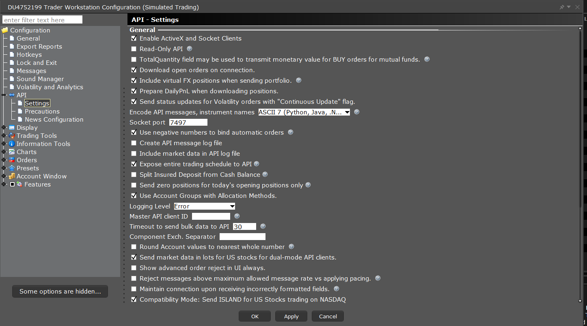
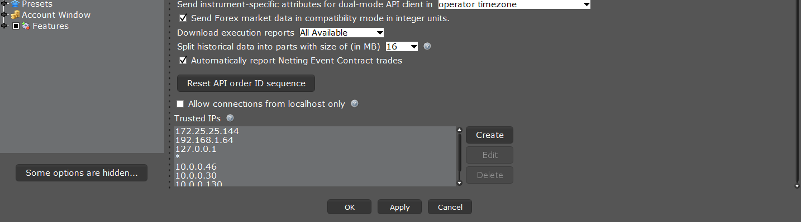

# u103_atm_option_exit_program

## Deploying Release 1.0 

TBD

## Preparing environment
This is one time activity to setup the environment 

### Remote access 

we need either rust desk or teamviewer  
rustdesk:  https://rustdesk.com/  

### install python 
https://www.python.org/ftp/python/3.11.0/python-3.11.0-amd64.exe

### install git 

https://git-scm.com/downloads/win

### install node.js

https://nodejs.org/en/download 

### Steps 
in the C: drive   
mkdir code  
cd code   
git checkout https://github.com/SaeedBohlooli/u103_atm_option_exit_program.git  
cd u103_atm_option_exit_program  
python -version  
pip install -r requirements.txt  

### TWS
Make it like below

  
  
